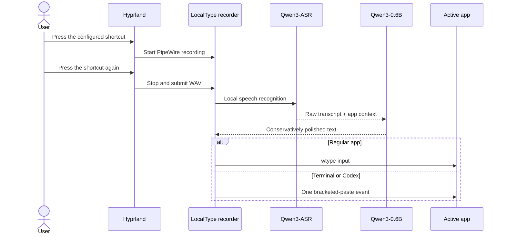

# LocalType for Omarchy

[简体中文](README.zh-CN.md)

LocalType is a local-first Chinese smart dictation plugin for Omarchy. It uses
[Qwen3-ASR-1.7B](https://huggingface.co/Qwen/Qwen3-ASR-1.7B) for speech recognition and Qwen3-0.6B for conservative cleanup of filler words, corrections, and punctuation. Audio and text stay on your machine by default.


## One-command installation

```bash
omarchy plugin add https://github.com/NuckyInSg/omarchy-localtype.git --enable
```

The plugin installs its runtime, models, user-level systemd service, desktop launcher, and Hyprland shortcuts. The first installation downloads the models and may take several minutes.

## Usage

| Default shortcut | Action |
|---|---|
| `F9` | Start or stop smart dictation |
| `Shift+F9` | Start or stop verbatim dictation |

LocalType types text but never presses Enter, sends a message, or executes a terminal command. Terminal apps receive the full transcript in one bracketed-paste event so TUIs such as Codex do not split it into multiple submissions.

Open the desktop app from the Omarchy launcher, the bar panel, or the CLI:

```bash
localtypectl open
```

The native Omarchy app includes Workspace, History, Dictionary, Scenes, Models, and Settings pages. It follows the active Omarchy theme.

### Language and shortcuts

The app defaults to English. Select **Settings → App language → 简体中文** to switch the desktop app, bar panel, and notifications to Chinese.

Edit both shortcut fields in **Settings → Shortcuts**, then choose **Apply shortcuts**. You can also update them from the CLI:

```bash
localtypectl shortcuts-set "F9" "SHIFT + F9"
```

## Requirements

- Omarchy and an NVIDIA GPU; at least 6 GiB VRAM is recommended
- A working CUDA driver and microphone
- About 5 GB of free disk space for the first model download
- `uv`, PipeWire, `wtype`, `wl-copy`, `jq`, `curl`, and `notify-send`

Validated on an RTX 5070 8 GiB. Both resident models use about 4.7–5.6 GiB VRAM.

## Management

```bash
localtypectl status
localtypectl doctor
localtypectl restart
localtypectl edit-dictionary
localtypectl open history
```

Update:

```bash
omarchy plugin update app.localtype.voice-input
```

Uninstall the runtime and plugin while retaining models and personal data:

```bash
localtypectl uninstall
omarchy plugin remove app.localtype.voice-input
```

Remove all LocalType models and data as well:

```bash
localtypectl uninstall --purge
omarchy plugin remove app.localtype.voice-input
```

## Local data

- Plugin: `~/.config/omarchy/plugins/app.localtype.voice-input/`
- Models and Python runtime: `~/.local/share/localtype/`
- Dictionary: `~/.config/localtype/dictionary.json`
- Scenes and settings: `~/.config/localtype/`
- Dictation history and status: `~/.local/state/localtype/`
- User service: `~/.config/systemd/user/localtype.service`

If an older `~/.local/share/qwen3-asr/` installation is present, LocalType reuses its Python environment and model cache.

## How it works



See the [product direction](docs/PRODUCT.md) and [desktop gap analysis](docs/OPENTYPELESS_GAP_ANALYSIS.md) for the broader roadmap.

## Development

```bash
./scripts/check.sh
```

[MIT License](LICENSE)
