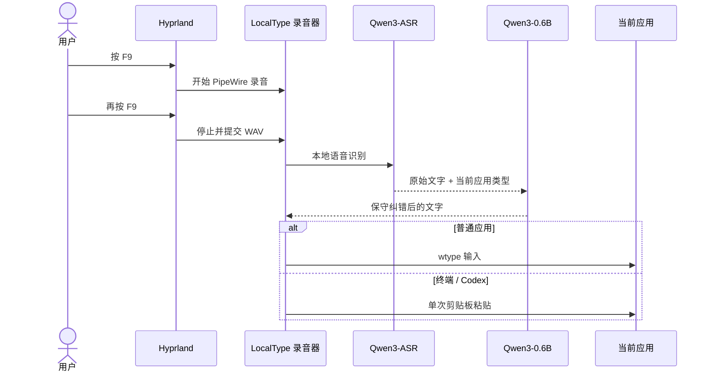

# LocalType for Omarchy

LocalType 是一个本地优先的中文智能语音输入插件。它使用
[Qwen3-ASR-1.7B](https://huggingface.co/Qwen/Qwen3-ASR-1.7B) 识别语音，再用
Qwen3-0.6B 保守地去除语气词、修正口误和补充标点。录音和文字默认不离开本机。


## 一键安装

```bash
omarchy plugin add https://github.com/NuckyInSg/omarchy-localtype.git --enable
```

启用插件后会自动完成运行环境、模型、用户级 systemd 服务和快捷键配置。首次安装需要下载模型，耗时取决于网络；状态栏组件会显示安装或模型加载状态。

## 使用

| 快捷键 | 行为 |
|---|---|
| `F9` | 按一次开始智能听写，再按一次停止、整理并输入 |
| `Shift+F9` | 按一次开始原文听写，再按一次停止并输入 |

插件不会代替你按回车，也不会自动发送消息或执行终端命令。在终端应用中，它通过一次剪贴板粘贴输入整段文字，避免 Codex 等 TUI 把长文本拆成多次提交。

桌面应用可从 Omarchy 应用启动器、状态栏面板中的 **Open app**，或下面的命令打开：

```bash
localtypectl open
```

工作台包含听写状态、历史、个人词典、应用场景、本地模型和设置六个页面，并自动跟随当前 Omarchy 主题。

## 系统要求

- Omarchy 与 NVIDIA GPU；建议至少 6 GiB 显存
- 可用的 CUDA 驱动和麦克风
- 首次下载需要约 5 GB 磁盘空间
- `uv`、PipeWire、`wtype`、`wl-copy`、`jq`、`curl` 和 `notify-send`

当前经过验证的设备是 RTX 5070 8 GiB，两个模型常驻时约占用 4.7–5.6 GiB 显存。

## 管理命令

```bash
localtypectl status
localtypectl doctor
localtypectl restart
localtypectl edit-dictionary
localtypectl open history
```

更新插件：

```bash
omarchy plugin update app.localtype.voice-input
```

卸载前先移除后台服务和快捷键，再删除插件：

```bash
localtypectl uninstall
omarchy plugin remove app.localtype.voice-input
```

模型和个人词典默认保留。若要一并删除：

```bash
localtypectl uninstall --purge
omarchy plugin remove app.localtype.voice-input
```

## 数据位置

- 插件代码：`~/.config/omarchy/plugins/app.localtype.voice-input/`
- 模型与 Python 环境：`~/.local/share/localtype/`
- 个人词典：`~/.config/localtype/dictionary.json`
- 应用场景：`~/.config/localtype/scenes.json`
- 桌面设置：`~/.config/localtype/settings.json`
- 听写历史：`~/.local/state/localtype/history.json`
- 状态：`~/.local/state/localtype/status.json`
- systemd 服务：`~/.config/systemd/user/localtype.service`

若检测到旧版 `~/.local/share/qwen3-asr/`，安装器会复用已下载的 Python 环境与模型缓存，避免重复下载。

## 工作原理



更完整的产品方向见 [产品文档](docs/PRODUCT.md)。

## 开发与校验

```bash
./scripts/check.sh
```

本项目采用 [MIT License](LICENSE)。
