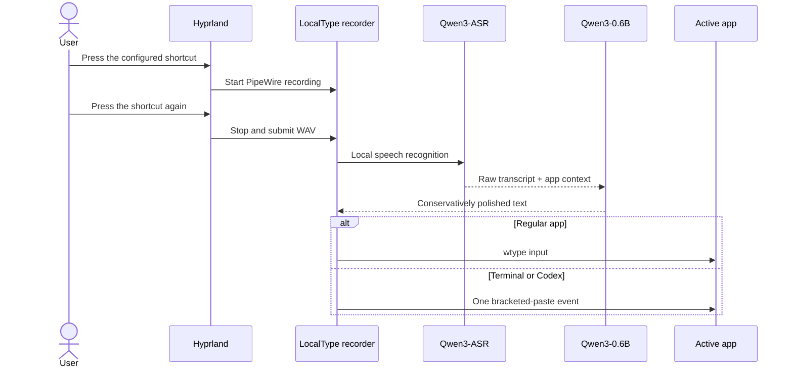

# LocalType for Omarchy

[简体中文](README.zh-CN.md)

LocalType is a local-first Chinese smart dictation plugin for Omarchy. It uses
[Qwen3-ASR-1.7B](https://huggingface.co/Qwen/Qwen3-ASR-1.7B) for speech recognition and Qwen3-0.6B for conservative cleanup of filler words, corrections, and punctuation. Audio and text stay on your machine by default.


## One-command installation

```bash
omarchy plugin add https://github.com/NuckyInSg/omarchy-localtype.git --enable
```

The plugin installs its runtime, models, user-level systemd service, desktop launcher, and Hyprland shortcuts. The first installation downloads the models and may take several minutes.

## Usage

| Default shortcut | Action |
|---|---|
| `F9` | Start or stop smart dictation |
| `Shift+F9` | Start or stop verbatim dictation |
| `Ctrl+Shift+F9` | Learn a correction from the selected corrected sentence |

LocalType types text but never presses Enter, sends a message, or executes a terminal command. While dictating, a Typeless-inspired capsule stays at the bottom center of the focused display, with cancel/finish controls and a waveform; it contracts to a local-processing indicator after you stop. Routine start, processing, and completion notifications are replaced by this surface; errors still use a desktop notification. The overlay never takes keyboard focus and only its control capsule intercepts pointer input. Its blue transcript card is wired for ephemeral streaming text, which is never committed to history or learning. Terminal apps receive one bracketed-paste event so TUIs such as Codex do not split it; Chromium-based browsers use one clipboard paste to avoid dropping the first virtual character.

Open the desktop app from the Omarchy launcher, the bar panel, or the CLI:

```bash
localtypectl open
```

The native Omarchy app follows the active theme and keeps its main navigation to three tasks: **Dictate**, **History**, and **Dictionary**. Settings live behind the gear button; model diagnostics, scene rules, and prompt tuning stay out of the everyday workflow.

### Correction learning

When LocalType gets a name or product term wrong, correct it normally in the target app, select the complete corrected sentence, and press `Ctrl+Shift+F9`. LocalType aligns it with the latest dictation from that app. One clear local correction is learned immediately; ambiguous or multi-part edits go to **Dictionary → Review corrections**. You never have to author a replacement rule yourself.

You can also choose **Correct & learn** on a History entry and edit the full sentence inside LocalType. Canonical spellings bias Qwen3-ASR before recognition. After recognition, scoped or proper-name-like exact aliases are applied safely, while phonetic and orthographic matches are checked against sentence context by the local language model—never a blind global replacement. Large rewrites, deletions, and punctuation-only edits are not learned. Dictionary entries can contain just a canonical word; pronunciation is optional.

Enable **Settings → General → Learn from speech segments** for acoustic learning. LocalType then keeps a local 20-item recording ring buffer. On correction, Qwen3-ForcedAligner locates the edited field and only its short phrase clip and acoustic features are retained. Later dictations fuse text/Pinyin candidates with DTW audio similarity. Audio never triggers a replacement by itself, and true homophones still require sentence semantics. Disabling the option immediately clears buffered full recordings; confirmed phrase samples remain until their correction record is deleted.

### Language and shortcuts

The app defaults to English. Select **Settings → App language → 简体中文** to switch the desktop app, bar panel, and notifications to Chinese.

Edit the three shortcut fields in **Settings → Shortcuts**, then choose **Apply shortcuts**. You can also update them from the CLI:

```bash
localtypectl shortcuts-set "F9" "SHIFT + F9" "CTRL + SHIFT + F9"
```

### Editable polish prompt

Open **Settings → Advanced settings → Polish Prompt** to inspect and edit the complete Chat Prompt used by Qwen3-0.6B. The default JSON contains the system instruction and input/output examples; `{context}` expands to the active app class. Plain-text system prompts are also supported. Saved changes apply to the next dictation without restarting the service.

## Requirements

- Omarchy and an NVIDIA GPU; at least 6 GiB VRAM is recommended
- A working CUDA driver and microphone
- About 5 GB for the base models; the first acoustic correction additionally downloads Qwen3-ForcedAligner-0.6B
- `uv`, PipeWire, `wtype`, `wl-copy`, `jq`, `curl`, and `notify-send`

Validated on an RTX 5070 8 GiB. Both resident models use about 4.7–5.6 GiB VRAM.

## Management

```bash
localtypectl status
localtypectl doctor
localtypectl restart
localtypectl edit-dictionary
localtypectl open history
localtypectl logs 20
```

Update:

```bash
omarchy plugin update app.localtype.voice-input
```

Uninstall the runtime and plugin while retaining models and personal data:

```bash
localtypectl uninstall
omarchy plugin remove app.localtype.voice-input
```

Remove all LocalType models and data as well:

```bash
localtypectl uninstall --purge
omarchy plugin remove app.localtype.voice-input
```

## Local data

- Plugin: `~/.config/omarchy/plugins/app.localtype.voice-input/`
- Models and Python runtime: `~/.local/share/localtype/`
- Dictionary: `~/.config/localtype/dictionary.json`
- Learned corrections and review state: `~/.config/localtype/learned_corrections.json`
- Scenes and settings: `~/.config/localtype/`
- Dictation history and status: `~/.local/state/localtype/`
- Optional recent-audio ring buffer: `~/.local/state/localtype/audio/recent/` (unused while acoustic learning is off)
- Confirmed phrase clips and features: `~/.local/state/localtype/acoustic-memory/`
- Rotating pipeline diagnostics: `~/.local/state/localtype/pipeline.jsonl` (up to four 5 MiB files; the log itself contains no audio)
- User service: `~/.config/systemd/user/localtype.service`

If an older `~/.local/share/qwen3-asr/` installation is present, LocalType reuses its Python environment and model cache.

## How it works



See the [product direction](docs/PRODUCT.md) and [desktop gap analysis](docs/OPENTYPELESS_GAP_ANALYSIS.md) for the broader roadmap.

## Development

```bash
./scripts/check.sh
```

See the Chinese [ASR correction research and design](docs/ASR_CORRECTION_RESEARCH.md) for the Typeless, paper, and open-source review behind this pipeline.

[MIT License](LICENSE)
