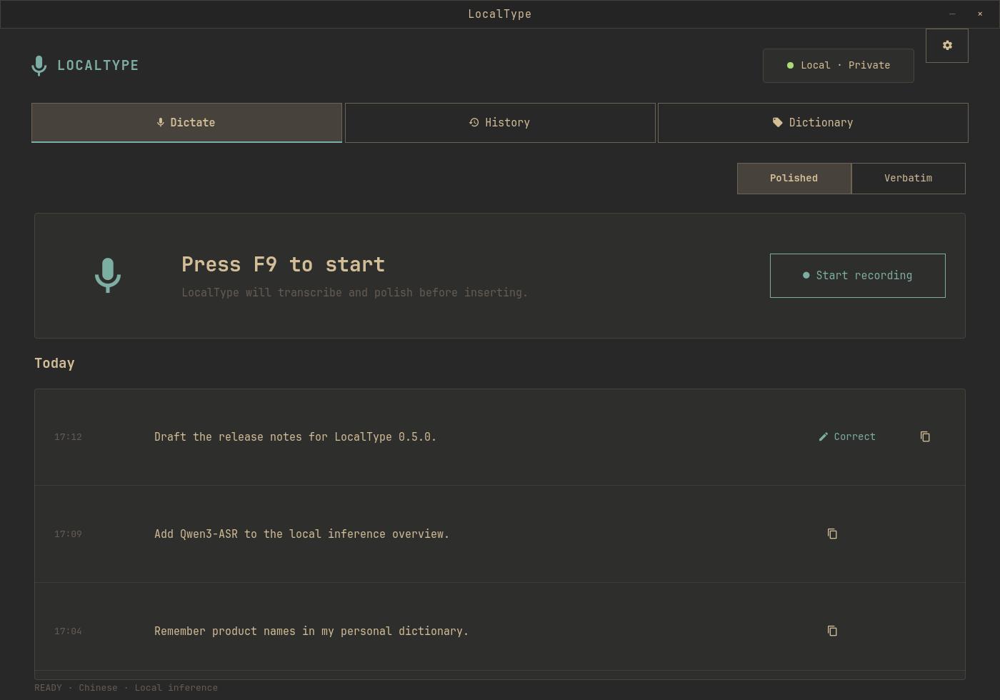

# LocalType for Omarchy

[English](README.md)

LocalType 是一个本地优先的中文智能语音输入插件。它使用 [Qwen3-ASR-1.7B](https://huggingface.co/Qwen/Qwen3-ASR-1.7B) 识别语音，再用 Qwen3-0.6B 保守地去除语气词、修正口误和补充标点。录音和文字默认不离开本机。



## 一键安装

```bash
omarchy plugin add https://github.com/NuckyInSg/omarchy-localtype.git --enable
```

插件会自动安装运行环境、模型、用户级 systemd 服务、桌面启动器和 Hyprland 快捷键。首次安装需要下载模型，可能耗时数分钟。

## 使用

| 默认快捷键 | 行为 |
|---|---|
| `F9` | 开始或停止智能听写 |
| `Shift+F9` | 开始或停止原文听写 |
| `Ctrl+Shift+F9` | 从选中的修改后整句中学习纠错 |

插件只输入文字，不会代替你按回车、发送消息或执行终端命令。听写时，参考 Typeless 设计的胶囊浮层会显示在当前屏幕底部居中，提供取消、完成和波形反馈。Qwen3-ASR 通过 vLLM 接收本地 500 ms 音频块并更新上方蓝色文字卡片；未稳定的句尾可能随后续语音回滚修正。停止后临时文字立即丢弃，胶囊收缩为本地处理状态；LocalType 再对完整 WAV 独立执行一次最终 ASR、声学纠错和 Polish。最终结果会先进入可编辑的悬浮确认框，不会直接写入目标应用：按 `Enter`（或点击确认胶囊）才会整段粘贴回听写开始时的输入框，`Shift+Enter` 换行，`Esc` 丢弃。若用户在确认框中修改了局部错字，LocalType 会自动比较识别结果和提交文本，提取错误片段并进入现有纠错学习流程。流式文字不会进入历史或学习数据。录音阶段浮层不抢占键盘焦点；只有最终确认阶段会临时取得焦点。终端与浏览器均通过一次整段粘贴规避 TUI 拆分和虚拟按键丢字。

从 Omarchy 应用启动器、状态栏面板或命令行打开桌面应用：

```bash
localtypectl open
```

应用自动跟随当前 Omarchy 主题，主导航只保留 **听写、历史、词典** 三个核心任务。设置从右上角齿轮进入；模型诊断、场景规则和提示词调优不再干扰日常使用。

### 纠错学习

当 LocalType 把人名、产品名或术语识别错时，直接在听写完成后的悬浮确认框中修改再按 `Enter`。LocalType 会自动对齐修改前后的整句：单个、明确的局部纠错会直接学习；多处或有歧义的修改才会进入 **词典 → 确认纠错**。用户不需要自己编写替换规则。

若文字已经提交，也仍可在目标应用中改正，选中修改后的完整句子并按 `Ctrl+Shift+F9` 触发相同的学习流程。

也可以在任意历史记录上选择“纠正并学习”，直接在 LocalType 中修改整句。学到的标准写法会在下一次听写前传给 Qwen3-ASR；识别后，作用域明确或具有专名结构的精确别名会安全应用，拼音和字形近似项则由本地语言模型结合整句语义决定，避免无条件全局替换。大段改写、删除和纯标点变化不会被学习。词典也支持只添加标准词语，近似读音为可选项。

在 **设置 → 常规 → 从语音片段学习** 中可开启声学学习。开启后 LocalType 在本机循环暂存最近 20 条录音；用户纠错时使用 Qwen3-ForcedAligner 定位对应字段，只长期保存该词语的小段音频与声学特征。后续听写会融合文本/拼音候选与 DTW 音频相似度；音频不会单独触发替换，同音词仍由整句语义判断。关闭开关会立即清除暂存的完整录音，但保留已确认的词语声学样本，直到删除对应纠错记录。

### 语言和快捷键

应用默认使用英文。在 **Settings → App language → 简体中文** 中可将桌面应用、状态栏面板和通知切换为中文。

在 **设置 → 快捷键** 中点击要修改的一项，然后直接按下新的组合键、鼠标中键/侧键或滚轮方向；界面会自动显示并保存，按 `Esc` 可取消捕获。也可以一次通过命令修改三项：

```bash
localtypectl shortcuts-set "F9" "SHIFT + F9" "CTRL + SHIFT + F9"
```

### 可编辑的润色提示词

在 **设置 → 高级设置 → 润色提示词** 中可以查看和编辑 Qwen3-0.6B 实际使用的完整 Chat Prompt。默认 JSON 包含 system 指令和输入/输出示例，`{context}` 会替换为当前应用类名；也支持直接填写纯文本 system prompt。保存后下一次听写立即生效，无需重启服务。

## 系统要求

- Omarchy 与 NVIDIA GPU；vLLM 流式识别建议 8 GiB 显存
- 可用的 CUDA 驱动和麦克风
- Python/vLLM 环境与基础模型合计约需 16 GB；开启声学学习后首次纠错还会下载约 2 GB 的 Qwen3-ForcedAligner-0.6B
- `uv`、PipeWire、`wtype`、`wl-copy`、`jq`、`curl` 和 `notify-send`

已在 RTX 5070 8 GiB 上验证：调优后的 vLLM ASR 与常驻润色模型从启动到持续推理约占用 6.4–7.2 GiB 显存，实测余量约 0.9 GiB。服务会在报告就绪前完成首次流式解码预热。

## 管理命令

```bash
localtypectl status
localtypectl doctor
localtypectl restart
localtypectl edit-dictionary
localtypectl open history
localtypectl logs 20
```

更新：

```bash
omarchy plugin update app.localtype.voice-input
```

卸载运行环境和插件并保留模型与个人数据：

```bash
localtypectl uninstall
omarchy plugin remove app.localtype.voice-input
```

一并删除全部模型与数据：

```bash
localtypectl uninstall --purge
omarchy plugin remove app.localtype.voice-input
```

## 本地数据

- 插件：`~/.config/omarchy/plugins/app.localtype.voice-input/`
- 模型与 Python 环境：`~/.local/share/localtype/`
- 个人词典：`~/.config/localtype/dictionary.json`
- 纠错学习与审核状态：`~/.config/localtype/learned_corrections.json`
- 场景与设置：`~/.config/localtype/`
- 听写历史与状态：`~/.local/state/localtype/`
- 可选的近期录音环形缓存：`~/.local/state/localtype/audio/recent/`（声学学习关闭时不保存）
- 已确认词语的声学样本：`~/.local/state/localtype/acoustic-memory/`
- 滚动流水线诊断日志：`~/.local/state/localtype/pipeline.jsonl`（最多四个 5 MiB 文件，日志本身不保存音频）
- 用户服务：`~/.config/systemd/user/localtype.service`

若检测到旧版 `~/.local/share/qwen3-asr/`，安装器会复用已有 Python 环境与模型缓存。

## 开发与校验

```bash
./scripts/check.sh
```

纠错方案的竞品、论文、开源项目调研与技术取舍见 [ASR 纠错方案调研](docs/ASR_CORRECTION_RESEARCH.md)。

[MIT License](LICENSE)
